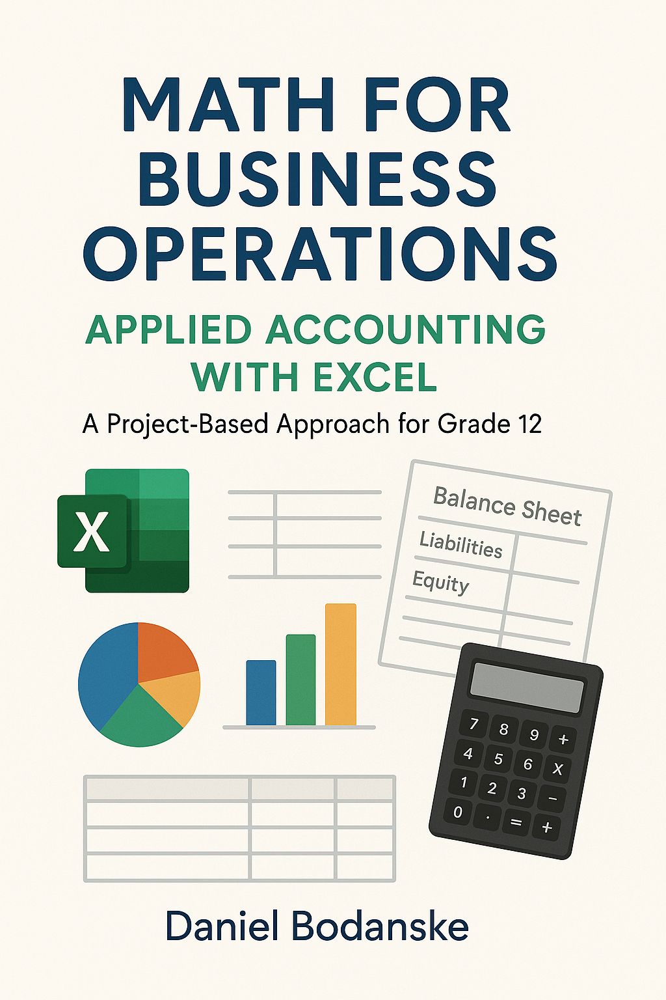

# Math for Business Operations: Applied Accounting with Excel

**A comprehensive Grade 12 educational platform integrating accounting principles, spreadsheet modeling, and entrepreneurship through project-based learning.**



## 📚 Project Overview

This project is a full-featured educational platform designed for Grade 12 students taking "Math for Business Operations." It combines traditional accounting education with modern spreadsheet literacy, entrepreneurial thinking, and real-world problem-solving through an engaging, project-based curriculum.

### Key Features

- **Interactive Next.js Web Application** - Modern, responsive educational interface with 50+ interactive components
- **8 Comprehensive Learning Units** - Progressive skill building from basic ledgers to complex financial modeling
- **Authentic Project-Based Learning** - Students work on real business scenarios with community connections
- **Advanced Excel Integration** - VBA, Power Query, financial functions, and automation
- **Professional Assessment System** - Industry-standard rubrics and peer review processes
- **Capstone Project Framework** - 13-week integrated business plan development

## 🎯 Interactive Learning Experience

### Student Journey Example: Sarah's TechStart Solutions

Students follow the authentic story of **Sarah Chen**, founder of TechStart Solutions, a digital marketing startup. Through her challenges and successes, students learn essential business and Excel skills:

**Unit 1 Experience:**
1. **Hook Phase** - Watch Sarah's video story about tracking $3,950 in client projects using chaotic notebooks
2. **Comprehension Check** - Interactive quiz about Sarah's business model and challenges
3. **Skill Practice** - Drag-and-drop exercises categorizing Sarah's actual transactions
4. **Excel Application** - Build a self-auditing ledger using Sarah's real business data
5. **Reflection** - Journal about lessons learned from Sarah's experience
6. **Assessment** - 4-minute investor pitch presenting the completed ledger system

### Interactive Components Showcase

**🧮 Accounting & Excel Tools:**
- **T-Account Visualizations** - Interactive double-entry bookkeeping practice
- **Spreadsheet Simulator** - Practice Excel Tables, SUMIF functions, conditional formatting
- **Trial Balance Builder** - Automated error-checking and validation systems

**🎮 Business Simulations:**
- **Startup Journey** - Navigate critical business decisions with real consequences
- **Budget Balancer** - Interactive cash flow management challenges
- **Pitch Presentation Builder** - Create investor-ready presentations with guided templates

**📊 Data Visualization:**
- **Financial Dashboard** - Real-time KPI tracking and analysis
- **Break-Even Chart** - Interactive cost-volume-profit analysis
- **Multi-Statement View** - Integrated financial statement relationships

**🔄 Drag-and-Drop Learning:**
- **Transaction Categorization** - Sort business activities by account type
- **Financial Statement Matching** - Connect transactions to their statement impact
- **Ratio Analysis Sorting** - Match financial ratios to their business meaning

## 🏗️ Architecture

### Technology Stack

- **Frontend**: Next.js 15 with App Router, TypeScript, Tailwind CSS
- **UI Components**: shadcn/ui with Radix UI primitives
- **Charts & Visualization**: Recharts library
- **Interactive Elements**: @hello-pangea/dnd for drag-and-drop exercises
- **Deployment**: Static export optimized for GitHub Pages

### Project Structure

```
Business-Operations/
├── bus-math-nextjs/          # Main Next.js application
│   ├── src/
│   │   ├── app/              # Next.js App Router pages
│   │   ├── components/       # Reusable React components
│   │   │   ├── accounting/   # T-accounts, journal entries
│   │   │   ├── business-simulations/  # Interactive scenarios
│   │   │   ├── charts/       # Data visualization
│   │   │   ├── drag-drop-exercises/   # Learning activities
│   │   │   ├── financial-reports/     # Financial statements
│   │   │   └── ui/          # shadcn/ui components
│   │   ├── data/            # Unit content definitions
│   │   └── types/           # TypeScript interfaces
├── html/                    # Legacy HTML resources
├── dev-docs/               # Development documentation
└── qdrant_storage/         # Vector database for content search
```

## 📝 Educational Content Quality Examples

### Sarah's Authentic Business Narrative

The curriculum uses real business scenarios rather than abstract examples. Here's how Sarah's story creates authentic learning:

> **From Unit 1 Content:**
> 
> *"When Sarah first launched TechStart Solutions, the feeling was incredible. She landed three projects back-to-back: a website for a local bakery worth $2,200, social media setup for a pet grooming service for $650, and SEO work for a dental office for $1,100. The money was coming in, and it felt like her dream was becoming a reality.*
> 
> *But as Sarah herself admits, there was chaos behind the curtain. While she was focused on delivering great work for her clients, her own business records were a disaster. She was tracking every payment, every invoice, and every small software subscription by scribbling it down in a notebook."*

### 8th Grade Reading Level with Business Vocabulary

Content maintains accessibility while introducing professional terminology:

> **Accounting Equation Explanation:**
> 
> *"All business, from the smallest startup to the largest corporation, operates under one unbreakable rule. It's a rule of perfect balance, and it's the foundation of all financial tracking. This is the **Accounting Equation**."*
> 
> - **Assets**: What Sarah's business owns (cash, equipment, client payments owed)
> - **Liabilities**: What Sarah's business owes (software subscriptions, contractor payments)  
> - **Equity**: Sarah's ownership stake in the business (initial investment + profits)

### "Why This Matters" Integration

Every concept connects to student goals and real-world impact:

> *"Understanding debits and credits isn't just about following rules—it's about building the foundation for investor confidence. When Sarah shows potential investors her self-auditing ledger, they can immediately see that she understands how money flows through her business."*

### Assessment & Reflection Integration

**Formative Assessment Examples:**
- **Comprehension Checks**: Multiple-choice questions with detailed explanations using Sarah's data
- **Drag-Drop Exercises**: Categorize Sarah's actual client transactions by account type
- **Reflection Journals**: "How does understanding the accounting equation change your view of business?"

**Summative Assessment:**
- **Public Presentations**: 4-minute investor pitches to panels of local business professionals
- **Live Demonstrations**: Excel error-checking features working with real transaction data
- **Peer Review**: Structured feedback using industry-standard rubrics

## 📖 Curriculum Overview

### Unit Progression

**Unit 1: Smart Ledger Launch** (Weeks 1-2)
- *Driving Question*: How can we design a self-auditing ledger that would convince a potential angel investor we keep "clean books" from day 1?
- Excel tables, SUMIF functions, conditional formatting
- Public deliverable: 4-minute investor pitch with live demo

**Unit 2: Month-End Wizard** (Weeks 3-4)
- *Driving Question*: What automation can cut our month-end closing time from two days to two hours without sacrificing GAAP accuracy?
- Macros, VBA, named ranges, adjusting entries
- Public deliverable: Interactive Excel automation tool

**Unit 3: Three-Statement Storyboard** (Weeks 5-6)
- *Driving Question*: How do today's journal entries flow into a narrative of profit, solvency, and cash health that investors can trust?
- Cross-sheet linking, INDEX/MATCH, financial statement preparation
- Public deliverable: Investor one-pager with KPI dashboard

**Unit 4: Data-Driven Café** (Weeks 7-8)
- *Driving Question*: Given two years of POS data, what inventory and staffing plan will maximize weekend profits without raising waste above 3%?
- Descriptive statistics, regression analysis, Excel Analysis ToolPak
- Public deliverable: Management recommendation with forecast model

**Unit 5: PayDay Simulator** (Weeks 9-10)
- *Driving Question*: How can a small business owner predict payroll cash-outs and still make rent on time?
- XLOOKUP, payroll calculations, tax tables, reconciliation
- Public deliverable: Tutorial screencast for young entrepreneurs

**Unit 6: PriceLab Challenge** (Weeks 11-12)
- *Driving Question*: What pricing strategy hits our profit target while staying competitive in the local market?
- Cost-Volume-Profit analysis, Goal Seek, sensitivity analysis
- Public deliverable: Town-hall pricing debate presentation

**Unit 7: Asset & Inventory Tracker** (Weeks 13-14)
- *Driving Question*: Which depreciation and inventory methods best align with our cash-flow and tax strategy?
- SLN/DDB depreciation, FIFO/LIFO inventory, turnover ratios
- Public deliverable: Advisory brief to mock Board of Directors

**Unit 8: Year-1 Startup Model** (Weeks 15-18)
- *Driving Question*: Can we convince a micro-VC that our first-year financial model is robust enough to merit funding?
- Integrated three-statement model, scenario analysis, formula auditing
- Public deliverable: VC-style pitch with live Q&A

### Capstone Project (Semester 2)

A 13-week integrated project where students develop a complete business plan and Excel financial model, culminating in presentations to real venture capital mentors and community entrepreneurs.

## 🚀 Getting Started

### Prerequisites

- Node.js 18+ 
- npm or yarn package manager

### Development Setup

1. **Clone the repository**
   ```bash
   git clone https://github.com/your-repo/Business-Operations.git
   cd Business-Operations
   ```

2. **Navigate to the Next.js application**
   ```bash
   cd bus-math-nextjs
   ```

3. **Install dependencies**
   ```bash
   npm install
   ```

4. **Start development server**
   ```bash
   npm run dev
   ```

5. **Open in browser**
   Navigate to `http://localhost:3000`

### Build and Deploy

```bash
# Build static export for GitHub Pages
npm run build

# Lint code
npm run lint
```

## 🎯 Educational Philosophy

### Project-Based Learning (PBL)
- **Authentic Problems**: Real business challenges from local community partners
- **Public Products**: Students present to genuine audiences (investors, managers, entrepreneurs)
- **Student Voice & Choice**: Multiple paths through content, role selection, presentation formats

### Backward Design Framework
- **End Goals**: Clear professional competencies and mindsets
- **Assessment First**: Rubrics and success criteria guide instruction
- **Scaffolded Practice**: Progressive skill building with peer support

### CAP Development (Courage, Adaptability, Persistence)
- Weekly reflection journals track mindset growth
- Peer critique builds resilience and communication skills
- Public presentations develop professional confidence

## 🔧 Development & Contributing

### Development Workflow

**For Content Developers (Phase Pages):**

1. **Research Current Context**:
   ```bash
   cd bus-math-nextjs/
   
   # Read current lesson data from filesystem (source of truth)
   cat src/app/teacher/unit01/lesson-01/page.tsx  # Teacher objectives
   cat src/app/student/unit01/lesson01/lesson-data.ts  # Lesson structure
   cat src/app/student/unit01/unit01-text.md  # Content reference
   ```

2. **Find Appropriate Interactive Components**:
   ```bash
   # Use MCP curriculum server (recommended)
   mcp__curriculum-mcp__list_components
   mcp__curriculum-mcp__get_components --id="component-id"
   
   # Search by educational purpose
   find src/components -name "*Check*" -o -name "*Drag*" -o -name "*Journal*"
   ```

3. **Verify Component Import Syntax**:
   ```tsx
   // ✅ CORRECT - Most components use default exports
   import ComprehensionCheck from "@/components/exercises/ComprehensionCheck"
   import ReflectionJournal from "@/components/exercises/ReflectionJournal"
   
   // ❌ INCORRECT - Will cause import errors
   import { ComprehensionCheck } from "@/components/exercises/ComprehensionCheck"
   ```

4. **Write Content Following Style Guide**:
   - 8th grade reading level with business vocabulary
   - Sarah's TechStart Solutions narrative context
   - "Why this matters" explanations for every concept
   - Interactive components with real data (not placeholders)

5. **Update MCP Server** (if discrepancies found):
   ```bash
   mcp__curriculum-mcp__update_lesson --id="lesson-id" --newData
   mcp__curriculum-mcp__create_app_connection --lessonPhaseId="phase-id" --type="Component"
   ```

**For Component Developers:**

1. **Follow Component Architecture Patterns**:
   - **Accounting Components**: Traditional bookkeeping tools (T-accounts, journal entries)
   - **Business Simulations**: Interactive scenarios (startup journey, budget challenges)
   - **Charts**: Data visualization using Recharts
   - **Drag-Drop Exercises**: Kinesthetic learning activities using @hello-pangea/dnd
   - **Financial Reports**: Professional statement generators

2. **Document in MCP Server**:
   ```bash
   mcp__curriculum-mcp__create_component \
     --name="ComponentName" \
     --description="Educational purpose and key features" \
     --filePath="src/components/category/ComponentName.tsx" \
     --usageExample="Basic implementation example"
   ```

### Testing & Quality Assurance

**Browser Testing with Chrome MCP:**
```bash
# Test component functionality in real browser environment
mcp__chrome-mcp-studio__chrome_navigate --url="http://localhost:3000/student/unit01/lesson01/phase-1"
mcp__chrome-mcp-studio__chrome_get_interactive_elements  # Verify component accessibility
mcp__chrome-mcp-studio__chrome_console  # Monitor for React errors
```

**Component Testing:**
- Component unit tests for interactive elements
- Integration testing for complex drag-drop interactions
- Accessibility compliance testing
- Cross-browser compatibility verification

### Data Management

- **Primary Source**: Static content in `src/app/student/` and `src/app/teacher/`
- **Component Registry**: MCP curriculum server for searchable component database
- **Unit Structure**: TypeScript files (`src/data/unit01.ts` - `unit08.ts`) for metadata
- **Content Reference**: Markdown files (`unit01-text.md` - `unit08-text.md`) for comprehensive explanations

## 📚 Educational Standards Alignment

### Ontario Mathematics Curriculum
- **Data Management**: Statistics, probability, regression analysis
- **Functions & Relations**: Mathematical modeling, optimization
- **Financial Mathematics**: Present value, annuities, loan calculations

### Business Studies Integration
- **Accounting Principles**: GAAP compliance, financial statement preparation
- **Entrepreneurship**: Business plan development, market analysis
- **Information Technology**: Advanced spreadsheet modeling, automation

### 21st Century Skills
- **Critical Thinking**: Data analysis, scenario planning, risk assessment
- **Communication**: Professional presentations, written business reports
- **Collaboration**: Team roles, peer review, community partnerships
- **Technology Literacy**: VBA programming, database queries, web tools

## 🤝 Community Partnerships

### Authentic Audience Network

**Local Finance Professionals:**
- **CPAs & Accountants**: Judge Unit 1-3 presentations on ledger accuracy and GAAP compliance
- **Tax Preparers**: Provide feedback on record-keeping systems and audit readiness
- **Bookkeepers**: Mentor students on practical Excel techniques and error prevention

**Business Community:**
- **Local Entrepreneurs**: Share real challenges for Unit 4-6 case studies (inventory, pricing, payroll)
- **Restaurant/Café Owners**: Provide POS data for statistical analysis projects
- **Retail Store Managers**: Offer pricing and inventory scenarios for cost-volume-profit analysis

**Investment & Finance:**
- **Angel Investors**: Judge Unit 8 presentations and provide VC-style feedback
- **Bank Managers**: Evaluate loan applications and financial model projections
- **Financial Advisors**: Assess retirement planning and investment strategy projects

### Real-World Implementation Examples

**Unit 1: Smart Ledger Launch**
- Students present self-auditing Excel systems to **PTA members with finance backgrounds**
- **Local CPA firm** provides feedback on professional ledger standards
- **Startup founders** judge presentations on investor readiness

**Unit 4: Data-Driven Café**  
- **Campus cafeteria manager** shares 2 years of real POS transaction data
- Students analyze weekend staffing patterns and inventory waste
- Present findings to **school administration** for actual implementation consideration

**Unit 6: PriceLab Challenge**
- **Local coffee shop chain** presents real pricing dilemma to student teams
- Students research competitor pricing and create recommendation models
- **Business owner panel** evaluates proposals in town-hall format presentation

**Unit 8: Year-1 Startup Model**
- **Regional venture capital mentors** conduct authentic due diligence sessions
- Students pitch integrated financial models using **real market research**
- **SCORE business mentors** provide ongoing guidance throughout capstone development

### Community Impact Outcomes

**For Students:**
- Professional network development before graduation
- Real-world validation of technical and presentation skills
- Industry mentorship extending beyond classroom experience

**For Community Partners:**
- Access to fresh analytical perspectives on business challenges
- Talent pipeline identification for internships and entry-level positions
- Community engagement and educational impact investment

**Implementation Support:**
- Structured feedback protocols using professional business rubrics
- Technology setup assistance for remote/hybrid presentation formats
- Recognition programs acknowledging community partner contributions

## 📈 Assessment & Evaluation

### Formative Assessment (60%)
- **Milestone Tasks**: Weekly deliverables with peer review
- **Reflection Journals**: CAP development tracking
- **Peer Critique**: Structured feedback using professional rubrics

### Summative Assessment (40%)
- **Unit Deliverables**: Public presentations to authentic audiences
- **Technical Proficiency**: Excel model functionality and accuracy
- **Professional Communication**: Pitch decks, written reports, live demos
- **Capstone Project**: Integrated business plan and financial model

### Industry-Standard Rubrics
- **Model Integrity**: Formula accuracy, linking, automation
- **Analytical Insight**: Data interpretation, strategic reasoning
- **Professional Presentation**: Clarity, timing, audience engagement
- **Continuous Improvement**: Response to feedback, iterative refinement
