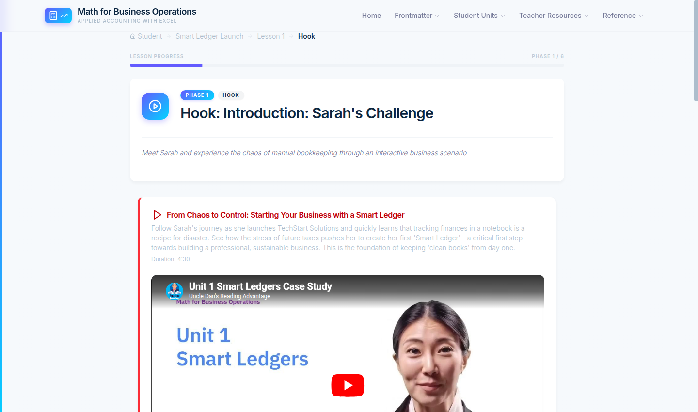
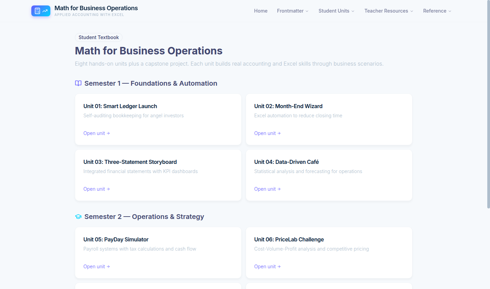
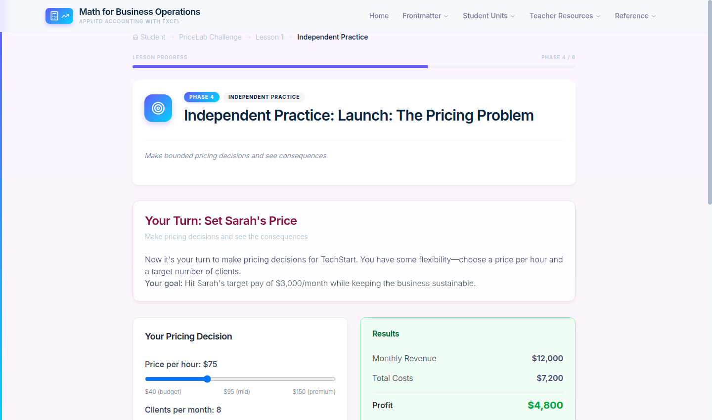
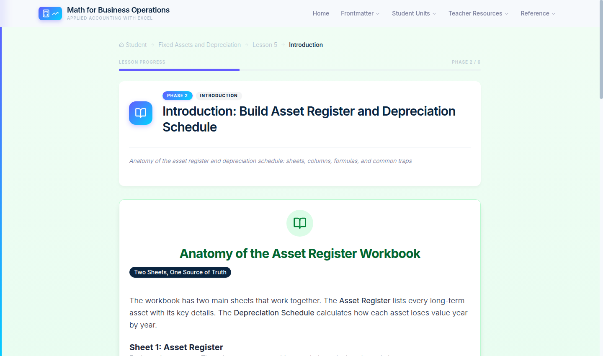
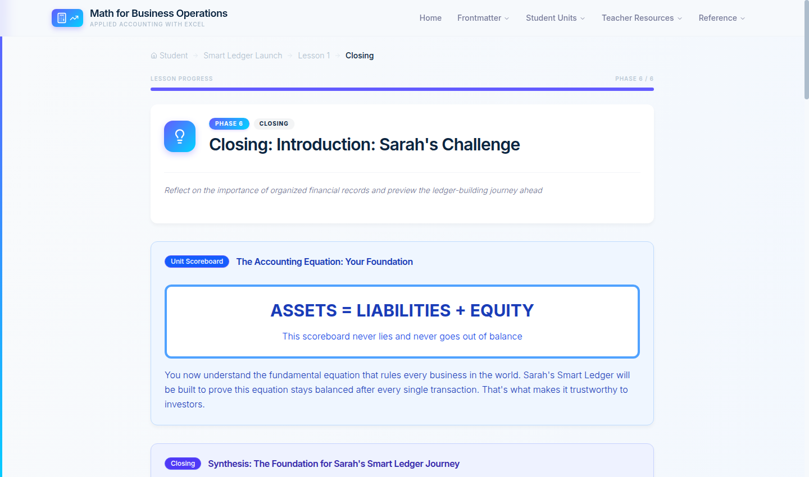
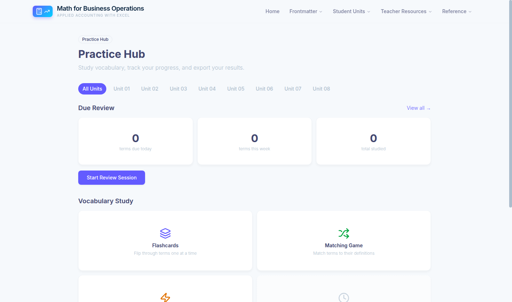
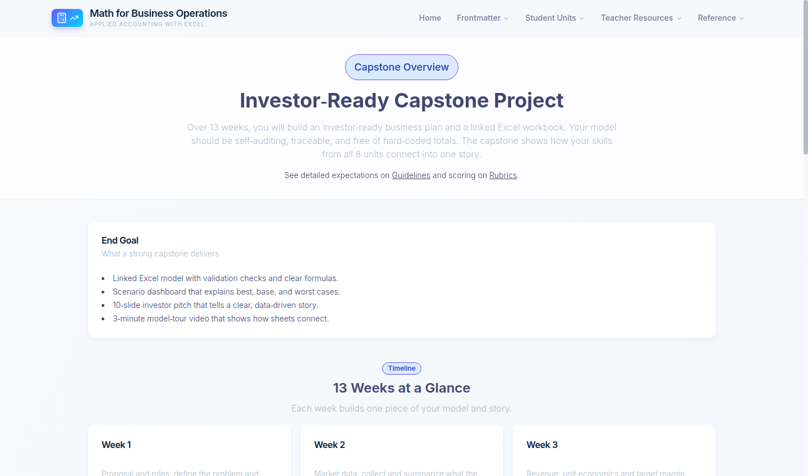

# Math for Business Operations

An interactive online textbook for teaching applied accounting, business math, and spreadsheet-based decision-making through authentic business scenarios.

## Built for Business Teachers

Math for Business Operations is designed for Grade 12 business operations, accounting, entrepreneurship, and career-technical classrooms. It gives students a full online textbook, not a loose collection of activities: eight applied units, a 13-week capstone, teacher resources, classroom routines, reference tools, and built-in practice surfaces.

The course follows Sarah Chen's TechStart Solutions as the core business narrative. Students learn accounting and Excel because the business needs them: keeping clean books, closing a month, explaining financial statements, forecasting operations, running payroll, pricing services, managing inventory, and tracking fixed assets.

## What Students Actually Do

- Build accounting fluency through ledgers, journal entries, financial statements, payroll, inventory, and depreciation.
- Practice Excel thinking through formulas, linked sheets, validation checks, dashboards, and scenario analysis.
- Make decisions in business contexts, including pricing, cost-volume-profit tradeoffs, payroll design, asset tracking, and investor-readiness.
- Use formative checks, reflection journals, vocabulary practice, and reference tools to strengthen understanding before major performance tasks.
- Finish with a 13-week capstone that connects the units into an investor-ready business plan, linked financial model, pitch deck, and model tour.

## Pedagogical Features

### Six-phase lesson design

Each lesson is organized into a predictable instructional arc:

1. Hook: introduce a business problem students can understand.
2. Introduction: teach the concept with worked context.
3. Guided Practice: model the process with scaffolded checks.
4. Independent Practice: let students make and test decisions.
5. Assessment: verify understanding before moving on.
6. Closing: synthesize learning through reflection and transfer.

That structure makes the textbook easier to teach from: students know where they are in the lesson, and teachers can use phases as natural stopping points for direct instruction, partner work, independent work, exit tickets, or homework.

### Formative assessment throughout

Interactive checks appear inside lesson phases, not only at the end. Students answer comprehension questions, complete fill-in-the-blank vocabulary prompts, use reflection journals, and revisit key concepts through practice modes. This supports quick classroom checks for understanding before students enter more complex spreadsheet or project work.

### Business simulations and decision tools

Lessons ask students to test business choices instead of simply memorizing terms. For example, the PriceLab unit includes a pricing decision surface where students adjust price and client volume, then immediately see revenue, cost, profit, and whether the scenario covers Sarah's target pay.

### Spreadsheet-first applied math

The textbook treats spreadsheets as a thinking tool. Students see accounting and operations models as structured workbooks with source data, formulas, validation checks, and linked outputs. Pages include spreadsheet previews and exercises for asset registers, depreciation schedules, payroll, financial statements, and scenario planning.

### Vocabulary and reference support

The Practice Hub gives students flashcards, matching, speed rounds, spaced review, progress tracking, and exportable study data. The bilingual glossary lets students study accounting and business vocabulary in English and Chinese, with filters for self-study.

### Teacher implementation resources

Teacher pages include project-based learning guidance, backward design framing, classroom routines, and unit-level resources. The teacher-facing materials make the textbook easier to adopt as a course sequence rather than as one-off activities.

## Screenshots

### Video hook and case narrative

Lesson openings can include a video-backed business case. Unit 1 begins with Sarah's bookkeeping chaos, then asks students to connect the scenario to clean books, investor confidence, and the need for a smarter ledger.

### Student textbook hub

The student hub frames the course as two semesters of applied business work: foundations and automation first, then operations and strategy. Students can launch units, the capstone, the practice hub, the bilingual glossary, and the subject index from one place.

### Interactive pricing decision

In Unit 6, students manipulate price and client volume, then read the business consequences. The page turns cost-volume-profit reasoning into a visible decision model.

### Spreadsheet modeling

In Unit 8, students study how an asset register and depreciation schedule work together. The lesson emphasizes linked sheets, formulas, book value, accumulated depreciation, and validation checks.

### Reflection and synthesis

Closing phases help students consolidate what they learned, connect business concepts to the larger course story, and reflect on courage, adaptability, and persistence.

### Practice hub

The Practice Hub supports vocabulary retention across the course through unit filters, due review, flashcards, matching, speed rounds, weak-topic review, progress tracking, and export.

### Capstone project

The capstone gives teachers a long-form performance task: students build a business plan, linked Excel model, pitch deck, and model-tour presentation over 13 weeks.

## Course Scope

- 8 core units, each built around an applied business operations challenge.
- 10 lessons per unit, with lesson phases for classroom pacing.
- A 13-week capstone sequence with weekly milestones.
- Teacher dashboard, methodology resources, classroom routines, and unit pages.
- Student practice hub, bilingual glossary, and subject index.
- Interactive components for checks, journals, drag-and-drop style practice, spreadsheet previews, and business decision models.

## Why It Works in a Classroom

This textbook is built around transfer. Students are not just told what accounting and Excel tools are; they use them to answer business questions that have consequences. The repeated six-phase structure lowers classroom management friction, while the business narrative gives teachers a coherent reason for each new skill.

It is also honest about complexity. Students learn that good business math is not about finding one magic answer. It is about building a model, checking assumptions, reading outputs, explaining tradeoffs, and improving the decision.
