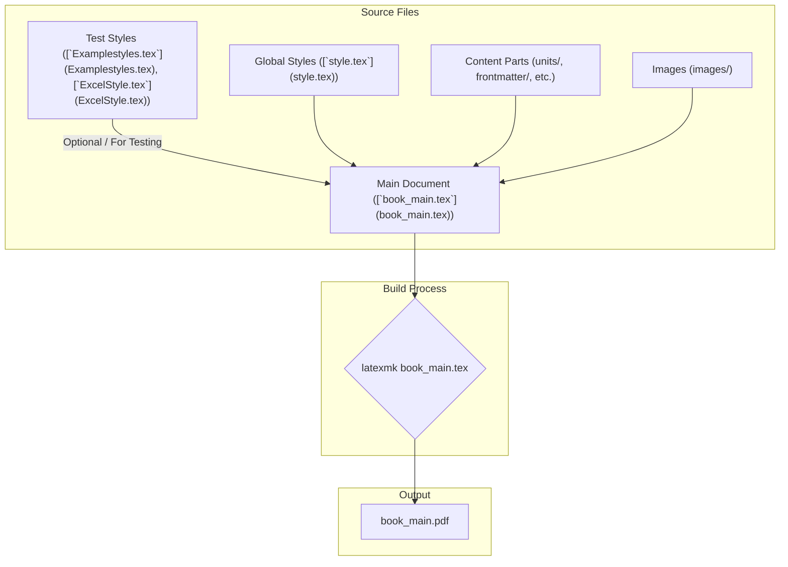

# Project Update Plan: LaTeX Workflow Transition

**Date:** 2025-05-21

**Objective:** Update the project's [`README.md`](README.md) to accurately reflect the transition to a LaTeX-only workflow, using `latexmk` for PDF compilation, and to correctly describe the current project structure and configuration, especially the contents of the `.roo/` directory.

---

## Plan Details:

### 1. Modify [`README.md`](README.md)

The following changes will be made to [`README.md`](README.md):

*   **"Getting Started" Section:**
    *   **Original Line 13:** `3. Use the templates in .roo/templates/ to create new content`
    *   **Change to:** `3. Review project-specific guidelines in the .roo/ directory as needed.`
    *   **Original Line 14:** `4. Build the textbook using the Makefile commands`
    *   **Change to:** `4. Build the textbook PDF using the latexmk book_main.tex command (see "Building the Textbook" section below).`

*   **"Building the Textbook" Section:**
    *   **Action:** Replace the entire existing content of this section.
    *   **New Content:**
        ```markdown
        To build the PDF version of the textbook, ensure you have a LaTeX distribution (like TeX Live, MiKTeX, or MacTeX) installed, which includes the `latexmk` utility. Navigate to the project's root directory in your terminal and run:

        ```bash
        latexmk book_main.tex
        ```

        This command will compile [`book_main.tex`](book_main.tex) and all its included files, handling cross-references and bibliography generation. The output will be `book_main.pdf` in the root directory.

        To clean up auxiliary files generated during compilation (e.g., `.aux`, `.log`, `.toc`), you can use:

        ```bash
        latexmk -c
        ```
        Or for a more thorough cleaning (including the PDF):
        ```bash
        latexmk -C
        ```
        ```

*   **"Configuration" Section:**
    *   **Action:** Replace the entire existing content of this section.
    *   **New Content:**
        ```markdown
        The primary configuration for the textbook's appearance and structure is managed through LaTeX:

        - **Global Styles & Macros:** Defined in [`style.tex`](style.tex).
        - **Main Document Structure:** Orchestrated by [`book_main.tex`](book_main.tex), which inputs content from the `frontmatter/`, `units/`, `capstone/`, and `backmatter/` directories.
        - **Auxiliary Style Files:** [`Examplestyles.tex`](Examplestyles.tex) and [`ExcelStyle.tex`](ExcelStyle.tex) are present for testing style modifications but are not part of the main build.

        The `.roo/` directory currently contains project-related documents:
        - [`Capstone_Project_Guidelines.md`](.roo/Capstone_Project_Guidelines.md): Guidelines for the capstone project.
        - [`custom-instructions.md`](.roo/custom-instructions.md): Custom instructions for AI assistant interactions with this project.
        ```

### 2. Workflow Visualization (Mermaid Diagram)

This diagram illustrates the new LaTeX-only build process:



---