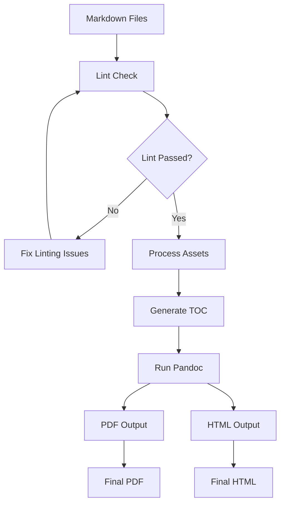

# Business Math & Finance Textbook Project Plan

This document outlines the structure and configuration for the Business Math & Finance textbook project, designed to work with Pandoc for generating both PDF and HTML outputs.

## Folder Structure

```
business-math-finance/
├── .roo/                           # Configuration directory
│   ├── templates/                  # Content templates
│   ├── styles/                     # CSS and LaTeX styling
│   ├── scripts/                    # Build scripts
│   ├── lint/                       # Linting rules
│   └── pandoc/                     # Pandoc configuration
├── assets/                         # Shared assets
│   ├── images/                     # Screenshots and diagrams
│   ├── excel/                      # Excel files for download
│   └── data/                       # Datasets for examples
├── frontmatter/                    # Title page, preface, TOC, etc.
├── semester1/                      # Semester 1 content
│   ├── unit1-smart-ledger/         # Unit 1 content
│   ├── unit2-month-end-wizard/     # Unit 2 content
│   ├── unit3-three-statement/      # Unit 3 content
│   ├── unit4-data-driven-cafe/     # Unit 4 content
│   ├── unit5-payday-simulator/     # Unit 5 content
│   ├── unit6-pricelab-challenge/   # Unit 6 content
│   ├── unit7-asset-inventory/      # Unit 7 content
│   └── unit8-integrated-model/     # Unit 8 content
├── semester2/                      # Semester 2 content
│   ├── week01-concept-proposal/    # Week 1 content
│   ├── week02-market-research/     # Week 2 content
│   ├── week03-revenue-streams/     # Week 3 content
│   ├── week04-startup-budget/      # Week 4 content
│   ├── week05-funding-strategy/    # Week 5 content
│   ├── week06-pricing-forecast/    # Week 6 content
│   ├── week07-payroll-plan/        # Week 7 content
│   ├── week08-inventory-planning/  # Week 8 content
│   ├── week09-depreciation-assets/ # Week 9 content
│   ├── week10-integrated-model/    # Week 10 content
│   ├── week11-sensitivity-risk/    # Week 11 content
│   ├── week12-pitch-deck/          # Week 12 content
│   └── week13-demo-day/            # Week 13 content
├── appendices/                     # Supplementary material
│   ├── excel-reference/            # Excel function reference
│   ├── accounting-principles/      # Accounting reference
│   ├── solutions/                  # Exercise solutions
│   └── glossary/                   # Terminology glossary
├── instructor/                     # Instructor resources
│   ├── rubrics/                    # Assessment rubrics
│   ├── lesson-plans/               # Detailed lesson plans
│   └── answer-keys/                # Answer keys for exercises
├── build/                          # Build output directory
│   ├── pdf/                        # PDF output
│   └── html/                       # HTML output
├── Makefile                        # Build automation
├── book.yaml                       # Main configuration file
└── README.md                       # Project documentation
```

## Configuration Files (.roo/ directory)

The `.roo/` directory will contain configuration files to enforce consistent formatting and provide templates for different content types:

### 1. Templates

```
.roo/templates/
├── unit-template.md           # Template for unit content
├── exercise-template.md       # Template for exercises
├── solution-template.md       # Template for solutions
├── case-study-template.md     # Template for case studies
├── excel-walkthrough.md       # Template for Excel walkthroughs
└── frontmatter-template.yaml  # YAML frontmatter template
```

### 2. Pandoc Configuration

```
.roo/pandoc/
├── pdf-config.yaml            # Pandoc config for PDF output
├── html-config.yaml           # Pandoc config for HTML output
├── filters/                   # Custom Pandoc filters
│   ├── number-exercises.lua   # Filter to number exercises
│   ├── collapsible-solutions.lua # Filter for collapsible solutions
│   └── excel-syntax.lua       # Filter for Excel formula highlighting
├── templates/                 # Pandoc templates
│   ├── pdf-template.tex       # LaTeX template for PDF
│   └── html-template.html     # HTML template
└── metadata.yaml              # Shared metadata
```

### 3. Linting Rules

```
.roo/lint/
├── markdownlint.json          # Markdown linting rules
├── heading-rules.js           # Rules for heading structure
├── exercise-rules.js          # Rules for exercise formatting
└── yaml-schema.json           # Schema for YAML frontmatter
```

### 4. Styles

```
.roo/styles/
├── pdf/
│   ├── main.tex               # Main LaTeX style
│   ├── code-highlighting.tex  # Code highlighting for PDF
│   └── exercise-styles.tex    # Exercise styling for PDF
└── html/
    ├── main.css               # Main CSS styles
    ├── code-highlighting.css  # Code highlighting for HTML
    └── exercise-styles.css    # Exercise styling for HTML
```

### 5. Build Scripts

```
.roo/scripts/
├── build.sh                   # Main build script
├── lint.sh                    # Linting script
├── image-processing.sh        # Script for processing images
└── generate-toc.sh            # Script to generate table of contents
```

## Content Structure

Each unit/week folder will have a consistent structure:

```
unit1-smart-ledger/
├── index.md                   # Main content file
├── objectives.md              # Learning objectives
├── key-concepts.md            # Key concepts
├── examples/                  # Example files
│   ├── example1.md
│   └── example2.md
├── exercises/                 # Exercise files
│   ├── exercise1.md
│   └── exercise2.md
├── images/                    # Unit-specific images
│   ├── screenshot1.png
│   └── diagram1.png
└── excel/                     # Unit-specific Excel files
    ├── template1.xlsx
    └── solution1.xlsx
```

## YAML Frontmatter Structure

Each Markdown file will include YAML frontmatter to provide metadata:

```yaml
---
title: "Smart Ledger Launch"
unit: 1
semester: 1
week: null
type: "unit"
learning_objectives:
  - "Design a self-auditing ledger"
  - "Apply the accounting equation"
  - "Create journal entries"
excel_skills:
  - "SUMIF"
  - "Conditional formatting"
  - "Running balances"
prerequisites:
  - "Basic Excel familiarity"
related_units:
  - "unit2-month-end-wizard"
---
```

## Markdown Styling Conventions

To ensure consistent formatting, the following conventions will be enforced:

1. **Headings**: Use ATX-style headings (# Heading 1) with consistent levels
   - # for unit titles
   - ## for major sections
   - ### for subsections
   - #### for sub-subsections

2. **Excel Formulas**: Use code blocks with Excel syntax highlighting
   ```excel
   =SUMIF(A2:A10,"Expenses",B2:B10)
   ```

3. **Exercises**: Use a consistent format with numbering
   ```markdown
   ::: exercise #1
   Calculate the accounting equation for the following scenario...
   :::
   ```

4. **Solutions**: Use a consistent format that can be made collapsible
   ```markdown
   ::: solution #1
   Assets = Liabilities + Equity
   $100,000 = $60,000 + $40,000
   :::
   ```

5. **Key Concepts**: Use callout boxes
   ```markdown
   ::: key-concept
   The accounting equation (Assets = Liabilities + Equity) is the foundation of double-entry bookkeeping.
   :::
   ```

## Pandoc Configuration

The Pandoc configuration will handle:

1. Converting Markdown to PDF and HTML
2. Applying consistent styling
3. Handling special elements like exercises and solutions
4. Generating a table of contents
5. Managing cross-references

### PDF Configuration Example

```yaml
# .roo/pandoc/pdf-config.yaml
from: markdown
to: pdf
template: .roo/pandoc/templates/pdf-template.tex
filters:
  - .roo/pandoc/filters/number-exercises.lua
  - .roo/pandoc/filters/excel-syntax.lua
pdf-engine: xelatex
variables:
  documentclass: book
  classoption: oneside
  fontsize: 11pt
  mainfont: "DejaVu Serif"
  sansfont: "DejaVu Sans"
  monofont: "DejaVu Sans Mono"
  geometry:
    - margin=1in
toc: true
toc-depth: 3
number-sections: true
highlight-style: tango
include-in-header: .roo/styles/pdf/main.tex
```

### HTML Configuration Example

```yaml
# .roo/pandoc/html-config.yaml
from: markdown
to: html5
template: .roo/pandoc/templates/html-template.html
filters:
  - .roo/pandoc/filters/number-exercises.lua
  - .roo/pandoc/filters/collapsible-solutions.lua
  - .roo/pandoc/filters/excel-syntax.lua
standalone: true
self-contained: true
toc: true
toc-depth: 3
number-sections: true
highlight-style: tango
css:
  - .roo/styles/html/main.css
  - .roo/styles/html/code-highlighting.css
  - .roo/styles/html/exercise-styles.css
```

## Build Process

The build process will:

1. Validate all Markdown files against linting rules
2. Process images and other assets
3. Generate the table of contents
4. Run Pandoc to create PDF and HTML outputs
5. Organize the outputs in the build directory

This can be automated using a Makefile:

```makefile
# Makefile
.PHONY: all pdf html lint clean

all: pdf html

pdf:
	@echo "Building PDF..."
	@mkdir -p build/pdf
	@pandoc --defaults=.roo/pandoc/pdf-config.yaml \
		--output=build/pdf/business-math-finance.pdf \
		frontmatter/*.md \
		semester1/*/*.md \
		semester2/*/*.md \
		appendices/*/*.md

html:
	@echo "Building HTML..."
	@mkdir -p build/html
	@pandoc --defaults=.roo/pandoc/html-config.yaml \
		--output=build/html/business-math-finance.html \
		frontmatter/*.md \
		semester1/*/*.md \
		semester2/*/*.md \
		appendices/*/*.md

lint:
	@echo "Linting Markdown files..."
	@.roo/scripts/lint.sh

clean:
	@echo "Cleaning build directory..."
	@rm -rf build
```

## Mermaid Diagram of the Build Process



## Implementation Plan

1. **Phase 1: Setup**
   - Create the folder structure
   - Set up the .roo/ directory with configuration files
   - Create templates for content types
   - Configure Pandoc settings

2. **Phase 2: Content Development**
   - Create sample content for one unit
   - Test the build process
   - Refine templates and styles

3. **Phase 3: Full Implementation**
   - Develop content for all units
   - Apply consistent formatting
   - Build the complete textbook

4. **Phase 4: Review and Refinement**
   - Review the output for consistency
   - Make adjustments to styles and templates
   - Finalize the textbook